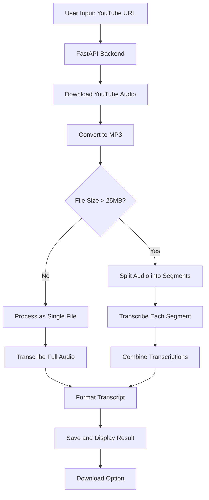

# YouTube to Transcript Converter

A web application that downloads YouTube videos, extracts audio, and leverages OpenAI's Whisper model to generate accurate transcripts, with special handling for multilingual content (Sinhala with English words).

Application Screenshot

## Features

- Download audio from YouTube videos
- Process and split large audio files
- Transcribe audio with OpenAI's Whisper model
- Handle mixed language content (Sinhala with English words preserved)
- Display and download formatted transcripts
- Simple, user-friendly web interface


## Architecture




## Installation

### Prerequisites

- Python 3.8 or higher
- FFmpeg installed on your system (required for audio processing)


### Install FFmpeg

#### Windows:

1. Download from [ffmpeg.org](https://ffmpeg.org/download.html)
2. Extract to a folder (e.g., C:\ffmpeg)
3. Add the bin folder to your PATH environment variable

#### macOS:

```bash
brew install ffmpeg
```


#### Linux:

```bash
sudo apt update
sudo apt install ffmpeg  # Ubuntu/Debian
# OR
sudo yum install ffmpeg  # CentOS
```


### Project Setup

1. Clone the repository:
```bash
git clone https://github.com/yourusername/youtube-transcript-converter.git
cd youtube-transcript-converter
```

2. Create and activate a virtual environment:
```bash
python -m venv .venv
source .venv/bin/activate  # On Windows: .venv\Scripts\activate
```

3. Install all dependencies:
```bash
pip install fastapi uvicorn jinja2 python-dotenv pytubefix moviepy openai pydub
```

4. Create a `.env` file in the project root with your OpenAI API key:
```
OPENAI_API_KEY=your_openai_api_key_here
```


## Usage

1. Start the application:
```bash
python main.py
```

2. Open your browser and navigate to:
```
http://localhost:8000
```

3. Enter a YouTube URL, click "Process Video", and wait for the transcription to complete.
4. View the transcript on the page and download it using the download button.

## Troubleshooting

### Common Issues

#### Error: `No module named 'moviepy.editor'`

This happens with newer versions of moviepy. Change your import to:

```python
from moviepy import AudioFileClip  # For moviepy 2.x
# OR
from moviepy.editor import AudioFileClip  # For moviepy 1.x
```


#### Error: `HTTP Error 400: Bad Request`

YouTube's API may have changed. Replace `pytube` with `pytubefix`:

```bash
pip install pytubefix
```


#### Error: `No such file or directory: 'ffprobe'`

FFmpeg is not installed or not in your PATH. See the FFmpeg installation instructions above.

#### Error: `Maximum content size limit exceeded`

For videos longer than ~10 minutes, the audio file may exceed OpenAI's 25MB limit. The application handles this by splitting the audio into smaller segments.

## API Endpoints

- **GET /** - Main page with web interface
- **POST /convert** - Convert YouTube URL to transcript
- **GET /download/{file_id}** - Download transcript file


## License

This project is licensed under the MIT License - see the LICENSE file for details.

## Acknowledgements

- [OpenAI Whisper](https://platform.openai.com/docs/guides/speech-to-text) for the transcription API
- [PyTubeFix](https://github.com/JuanBindez/pytubefix) for YouTube downloading
- [FastAPI](https://fastapi.tiangolo.com/) for the web framework
- [MoviePy](https://zulko.github.io/moviepy/) for audio file handling

---

